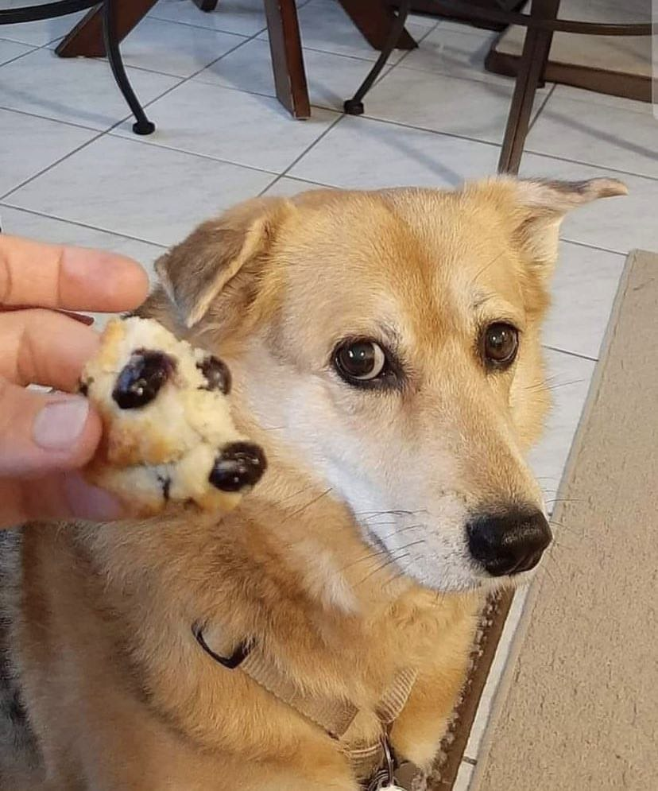

# ML_muffins-VS-chihua
There is a final project for ML course on Kaggle's dataset

### The task is:
* Transform images from JPG to RGB pixel values and scale pixels;
* Build at least 3 network architectures and train hyper parameters;
* Perform 5-fold cross-validation to compute risk estimates

